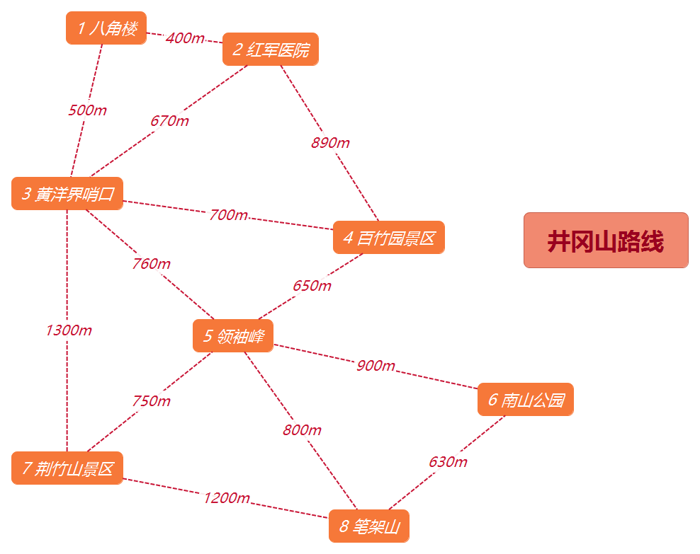

# 井冈山导游咨询系统-数据结构课程设计
### 一、系统功能
* 景点信息查询
* 路线智能规划（两点最短路径）
* 景区路线参考（所有可行路径）
* 最近景点查询
* 管理系统（登录验证）
* 景点信息、管理员密码更改
* 数据加解密（密码）
### 二、系统结构

### 三、数据存储结构
```C
#define M 8             // 景点个数

typedef struct
{
    int num;            // 景点编号
    char name[20];      // 景点名称
    char intro[400];    // 景点简介
} vertex;

typedef struct
{
    vertex vexs[M];     // 顶点信息数组
    int edge[M][M];     // 邻接矩阵
    int vexNum, edgNum; // 顶点数和边数
} mgraph;
```
### 四、函数模块
```C
// @Author Rx762
int menu();                      // 主菜单
int Login();                     // 后台登录校验
int Admin_Menu();                // 管理员主菜单
int Judge_Num(int num);          // 景点编号判断
void Change_Pwd();               // 管理员密码修改
void Admin_System();             // 后台管理系统
void Exit(int *quit);            // 主程序退出
void Admin_Exit(int *quit);      // 管理员系统退出
void Create_Map(mgraph *g);      // 读取文件内容建立图
void All_Scenic(mgraph *g);      // 输出所有景点信息
void Change_Info(mgraph *g);     // 景点信息修改
void Search_Scenic(mgraph *g);   // 景点信息查询
void Search_Distance(mgraph *g); // 查询与所在位置最近景点
void encrypt(char *s);           // 加密
void decrypt(char *s);           // 解密

// @Author qwq
void Ai_Plan(mgraph *g);                                            // dijkstra算法求最短路径
void showPath(int path[], int v0, int v1);                          // 输出单条路劲
void showResult(int v0, int v1, int dist[], int path[]);            // 输出最短路径

// @Author why
void showFloydPath(mgraph *g , int path[][M], int v0, int v);       // 输出起点到终点的中间结点
void showFloydResult(mgraph *g, int dist[][M], int path[][M]);      // 输出floyd算法的结果
void floyd(mgraph *g);                                              // floyd算法
```
### 五、井冈山景点路线图

### 六、备注
* 编码格式：GBK
* 编写过程中考虑到景点个数、景点间的距离基本上是保持不变的，因此景点信息增删功能并未实现
